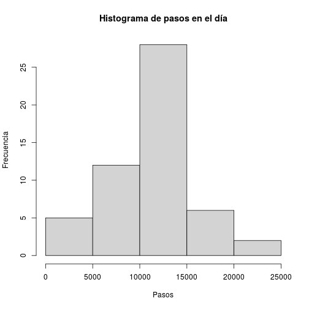
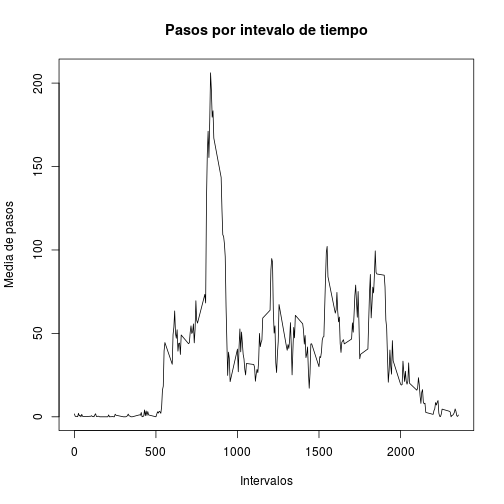
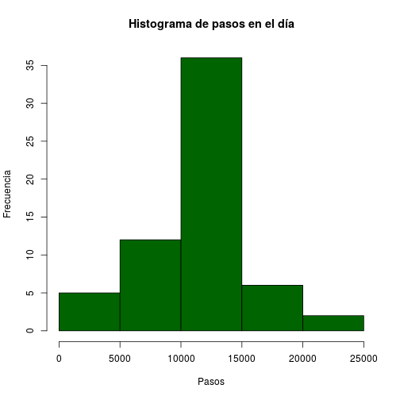
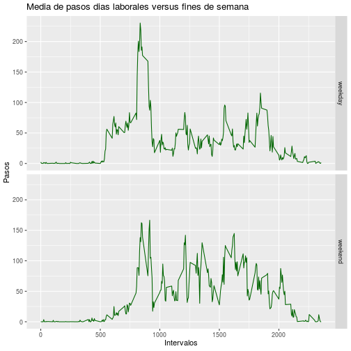

## 1.Introducción   
Ahora es posible recopilar una gran cantidad de datos sobre el movimiento personal utilizando dispositivos de monitoreo de actividad como Fitbit, Nike Fuelband o Jawbone Up. Este tipo de dispositivos son parte del movimiento del "yo cuantificado", un grupo de entusiastas que toman medidas sobre sí mismos con regularidad para mejorar su salud, para encontrar patrones en su comportamiento o porque son fanáticos de la tecnología. Pero estos datos siguen siendo infrautilizados tanto porque los datos brutos son difíciles de obtener como porque hay una falta de métodos estadísticos y software para procesar e interpretar los datos.  

Este proyecto utiliza datos de un dispositivo de monitoreo de actividad personal. Este dispositivo recopila datos a intervalos de 5 minutos durante todo el día. Los datos consisten en dos meses de datos de una persona anónima recopilados durante los meses de octubre y noviembre de 2012 e incluyen el número de pasos dados en intervalos de 5 minutos cada día.  


## 2. Carga de las librerias para la preparación, transformación y presentación de los datos    

```r
library(dplyr)
library(lubridate)
library(ggplot2)
```
## 3. Carga de los datos   
El contenido del fichero 'activity.csv' tiene la siguiente estructira:  
* steps: Number of steps taking in a 5-minute interval (missing values are coded as NA).  
* date: The date on which the measurement was taken in YYYY-MM-DD format.  
* interval: Identifier for the 5-minute interval in which measurement was taken.  
The dataset is stored in a comma-separated-value (CSV) file and there are a total of 17,568 observations in this dataset.

```r
fileUrl <- "https://d396qusza40orc.cloudfront.net/repdata%2Fdata%2Factivity.zip"
download.file(fileUrl,destfile="activity.zip",method="curl")
unzip(zipfile="activity.zip")
actividad <- read.csv("activity.csv")
```
## 4.Transformación los datos:
- El campo 'date' es transformado en 'class' 'date' para que sean conciderados como fechas.    
- Elegimos sólo los valores de 'steps' no vacios.  
- Creamos una nuevo valor con el dia de la semana según la fecha de la medición.   
   

```r
actividad$diasemana<-wday(actividad$date, label = TRUE, abbr = FALSE)
actividad$date<-as.Date(actividad$date, '%Y-%m-%d')
datos<-actividad
datos<-datos[!is.na(datos$steps),]
summary(datos)
```

```
##      steps             date               interval          diasemana   
##  Min.   :  0.00   Min.   :2012-10-02   Min.   :   0.0   Sunday   :2016  
##  1st Qu.:  0.00   1st Qu.:2012-10-16   1st Qu.: 588.8   Monday   :2016  
##  Median :  0.00   Median :2012-10-29   Median :1177.5   Tuesday  :2592  
##  Mean   : 37.38   Mean   :2012-10-30   Mean   :1177.5   Wednesday:2304  
##  3rd Qu.: 12.00   3rd Qu.:2012-11-16   3rd Qu.:1766.2   Thursday :2304  
##  Max.   :806.00   Max.   :2012-11-29   Max.   :2355.0   Friday   :2016  
##                                                         Saturday :2016
```

## 5.¿Cuál es el número total medio de pasos dados por día?    
Para esta parte de la tarea, ignoramos los valores faltantes en el conjunto de datos.  

### 5.1. Calculamos el número total de pasos dados por día y calculamos la media y la mediana.    
Se muestran sólo una muestra de los 20 primeros valores.  

```r
totalesdia <-datos %>%
    group_by(date) %>%
    summarise(totalsuma=sum(steps),.groups = 'drop')
head(totalesdia,20)
```

```
## # A tibble: 20 x 2
##    date       totalsuma
##    <date>         <int>
##  1 2012-10-02       126
##  2 2012-10-03     11352
##  3 2012-10-04     12116
##  4 2012-10-05     13294
##  5 2012-10-06     15420
##  6 2012-10-07     11015
##  7 2012-10-09     12811
##  8 2012-10-10      9900
##  9 2012-10-11     10304
## 10 2012-10-12     17382
## 11 2012-10-13     12426
## 12 2012-10-14     15098
## 13 2012-10-15     10139
## 14 2012-10-16     15084
## 15 2012-10-17     13452
## 16 2012-10-18     10056
## 17 2012-10-19     11829
## 18 2012-10-20     10395
## 19 2012-10-21      8821
## 20 2012-10-22     13460
```

### 5.2. Hacemos ahora un histograma del número total de pasos dados cada día.    

```r
hist(totalesdia$totalsuma, xlab='Pasos',main='Histograma de pasos en el día', ylab='Frecuencia')
```


   
   
### 5.3. Calculamos la media y la mediana del nuemro total de pasos por día.  
   

```r
media <- round(mean(totalesdia$totalsuma),digits = 2)  # Cálculo de la media
mediana <- round(median(totalesdia$totalsuma), digits=2)    # Cálculo de la mediana

print(paste('La media es: ',media, ' y las mediana es: ', mediana))
```

```
## [1] "La media es:  10766.19  y las mediana es:  10765"
```

  
## 6.¿Cuál es el patrón de actividad diaria promedio? ##  

### 6.1. Hacemos una gráfica de series de tiempo (es decir type = "l") del intervalo de 5 minutos (eje x) y el número medio de pasos dados, promediado en todos los días (eje y).  
  

```r
mediadia <-datos %>%
    group_by(interval) %>%
    summarise(media=mean(steps),.groups = 'drop')
head(mediadia,15)  # Mostramos los 15 primeros valores
```

```
## # A tibble: 15 x 2
##    interval  media
##       <int>  <dbl>
##  1        0 1.72  
##  2        5 0.340 
##  3       10 0.132 
##  4       15 0.151 
##  5       20 0.0755
##  6       25 2.09  
##  7       30 0.528 
##  8       35 0.868 
##  9       40 0     
## 10       45 1.47  
## 11       50 0.302 
## 12       55 0.132 
## 13      100 0.321 
## 14      105 0.679 
## 15      110 0.151
```

```r
plot(mediadia$media ~ mediadia$interval, type='l',xlab='Intervalos',ylab='Media de pasos',main='Pasos por intevalo de tiempo') # Grafico de pasos por intervalo de tiempo
```


  
### 6.2. ¿Qué intervalo de 5 minutos, en promedio en todos los días del conjunto de datos, contiene el número máximo de pasos?  
  

```r
intmax<-mediadia$interval[which.max(mediadia$media)]
maxpas<-round(mediadia$media[mediadia$interval==intmax],2)
print(paste('El intervalo que contiene el máximo de pasos, tal y como podemos ver en el diagrana es: ',intmax,' que corresponde a un valor de ', maxpas, ' pasos.'))
```

```
## [1] "El intervalo que contiene el máximo de pasos, tal y como podemos ver en el diagrana es:  835  que corresponde a un valor de  206.17  pasos."
```
  
  
## 7. Imputación de valores perdidos  ##
Tenga en cuenta que hay varios días / intervalos en los que faltan valores (codificados como N/A). La presencia de días perdidos puede introducir sesgos en algunos cálculos o resúmenes de los datos.

### 7.1. Calculamos e informamos el número total de valores faltantes en el conjunto de datos (es decir, el número total de filas con N/As)
  

```r
vacios<-sum(is.na(actividad$steps))
print(paste('El número de elementos faltantes (N/A) de las obervaciones asciente a un total de: ',vacios))          
```

```
## [1] "El número de elementos faltantes (N/A) de las obervaciones asciente a un total de:  2304"
```
  
  
### 7.2. Diseñamos la estrategia para completar todos los valores faltantes en el conjunto de datos.
  
La estrategia se basará en usar la media del  intervalo de 5 minutos en el que el valor es faltante, para asignar este valor a dicho elemento faltante(N/A).

  

```r
datossinNA <- actividad
vectorNA<-which(is.na(actividad$steps))
```
  
  
    
### 7.3. Creamos un nuevo conjunto de datos igual al conjunto de datos original pero con los datos faltantes completados, según la estrategía definida en el punto 7.2.  
  

```r
for (i in 1:vacios){
  datossinNA$steps[vectorNA[i]]<-mediadia$media[mediadia$interval==datossinNA$interval[vectorNA[i]]]
}
summary(datossinNA)
```

```
##      steps             date               interval          diasemana   
##  Min.   :  0.00   Min.   :2012-10-01   Min.   :   0.0   Sunday   :2304  
##  1st Qu.:  0.00   1st Qu.:2012-10-16   1st Qu.: 588.8   Monday   :2592  
##  Median :  0.00   Median :2012-10-31   Median :1177.5   Tuesday  :2592  
##  Mean   : 37.38   Mean   :2012-10-31   Mean   :1177.5   Wednesday:2592  
##  3rd Qu.: 27.00   3rd Qu.:2012-11-15   3rd Qu.:1766.2   Thursday :2592  
##  Max.   :806.00   Max.   :2012-11-30   Max.   :2355.0   Friday   :2592  
##                                                         Saturday :2304
```
    
    
### 7.4. Hacemos un histograma del número total de pasos dados cada día y calculamos e informamos la  media  y la  mediana del  número total de pasos dados por día.   
  

```r
# generamos datos sumarizados
nuevo <-datossinNA %>%
    group_by(date) %>%
    summarise(totalsuma=sum(steps),.groups = 'drop')

# Generamos el histrograma
hist(nuevo$totalsuma, xlab='Pasos',main='Histograma de pasos en el día', ylab='Frecuencia', col='darkgreen')
```



```r
#calculamos media y mediana
media2 <- round(mean(nuevo$totalsuma),digits = 2)  # Cálculo de la media
mediana2 <- round(median(nuevo$totalsuma), digits=2)    # Cálculo de la mediana

# presentamos los resultados
print(paste('La nueva media es:',media, 'pasos y la nueva mediana es:', mediana, 'pasos.'))
```

```
## [1] "La nueva media es: 10766.19 pasos y la nueva mediana es: 10765 pasos."
```
  
  
#### 7.4.1. ¿Estos valores difieren de las estimaciones de la primera parte de la tarea?   
  

```r
print(paste('Como podemos apreciar en la primera estimación, en la que obviamos los N/A,  la media era de: ',media, ' y la mediana de: ', mediana))
```

```
## [1] "Como podemos apreciar en la primera estimación, en la que obviamos los N/A,  la media era de:  10766.19  y la mediana de:  10765"
```

```r
print(paste('Y las nueva media:',media, 'y mediana:', mediana, 'pasos. Que como podemos apreciar son los mismos valores que los obtenidos en nuestra primera estimación. Por lo que parece que el despreciar estos valores no afectaría a las media y medianas estimadas. '))
```

```
## [1] "Y las nueva media: 10766.19 y mediana: 10765 pasos. Que como podemos apreciar son los mismos valores que los obtenidos en nuestra primera estimación. Por lo que parece que el despreciar estos valores no afectaría a las media y medianas estimadas. "
```
  
  
#### 7.4.2. ¿Cuál es el impacto de imputar los datos faltantes a las estimaciones del número total diario de pasos?
   
Por lo que parece no existe impacto de imputar estos datos faltantes , o no es resaltable, ya que no cambia, de forma perceptible, los valores estadísticos.  
  
   
## 8. ¿Existen diferencias en los patrones de actividad entre los días de semana y los fines de semana?  ##
Para esta parte haremos uso de la función weekdays(). Utilizaremos el conjunto de datos con los valores faltantes completados.
  
Para comprobarlorealizaremos los siguientes pasos:

### 8.1. Creamos una nueva variable de factor, que llamaremos 'periodosemana' en el conjunto de datos con dos niveles: "weekday" y "weekend", que indican si una fecha determinada es un día de la semana('weekday') o un fin de semana('wwekend').  
  

```r
# Generamos el nuevo valor
datossinNA<-mutate(datossinNA, periodosemana = ifelse(datossinNA$diasemana == 'Sunday' | datossinNA$diasemana =='Saturday','weekend','weekday'))
datossinNA$periodosemana <- as.factor(datossinNA$periodosemana)
str(datossinNA)
```

```
## 'data.frame':	17568 obs. of  5 variables:
##  $ steps        : num  1.717 0.3396 0.1321 0.1509 0.0755 ...
##  $ date         : Date, format: "2012-10-01" "2012-10-01" "2012-10-01" "2012-10-01" ...
##  $ interval     : int  0 5 10 15 20 25 30 35 40 45 ...
##  $ diasemana    : Ord.factor w/ 7 levels "Sunday"<"Monday"<..: 2 2 2 2 2 2 2 2 2 2 ...
##  $ periodosemana: Factor w/ 2 levels "weekday","weekend": 1 1 1 1 1 1 1 1 1 1 ...
```

```r
summary(datossinNA)
```

```
##      steps             date               interval          diasemana    periodosemana  
##  Min.   :  0.00   Min.   :2012-10-01   Min.   :   0.0   Sunday   :2304   weekday:12960  
##  1st Qu.:  0.00   1st Qu.:2012-10-16   1st Qu.: 588.8   Monday   :2592   weekend: 4608  
##  Median :  0.00   Median :2012-10-31   Median :1177.5   Tuesday  :2592                  
##  Mean   : 37.38   Mean   :2012-10-31   Mean   :1177.5   Wednesday:2592                  
##  3rd Qu.: 27.00   3rd Qu.:2012-11-15   3rd Qu.:1766.2   Thursday :2592                  
##  Max.   :806.00   Max.   :2012-11-30   Max.   :2355.0   Friday   :2592                  
##                                                         Saturday :2304
```
  
  
### 8.2 Hacemos, finalmente, un diagrama de serie de tiempo (es decir, type = "l") del intervalo de 5 minutos (eje x) y el número medio de pasos dados, promediado entre todos los días de la semana o los días de fin de semana (eje y).   
  

```r
# Calculamos las medias
mediasinNA <-datossinNA %>%
    group_by(interval,periodosemana) %>%
    summarise(media=mean(steps),.groups = 'drop')
# Generamos el gráfico
ggplot(mediasinNA, aes(interval, media))+
  geom_line(col="darkgreen")+ggtitle("Media de pasos dias laborales versus fines de semana")+
  xlab("Intervalos")+
  ylab("Pasos")+
  facet_grid(periodosemana ~ .)
```


  
Como podemos, la actividad en los fines de semana se va atenuada en los periodos desde 500 a 850 aprox, y se acrecienta en los periodos temporales por encima de los 850. Normal , por las actividades al aire libre que solemos realizar en los fines de semana , de forma general. Y normalmente en horarios más tardios que entre semana.
